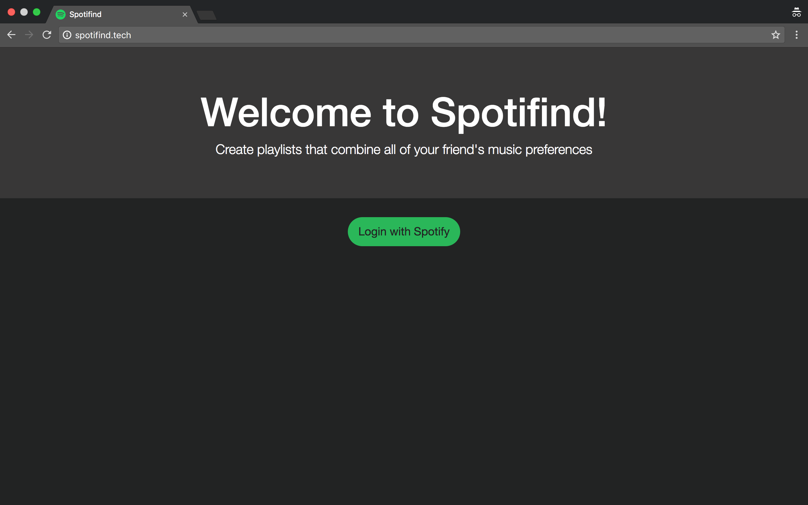
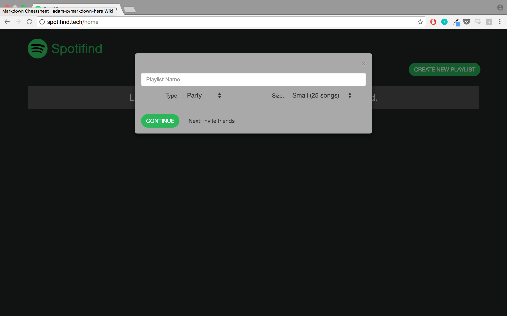
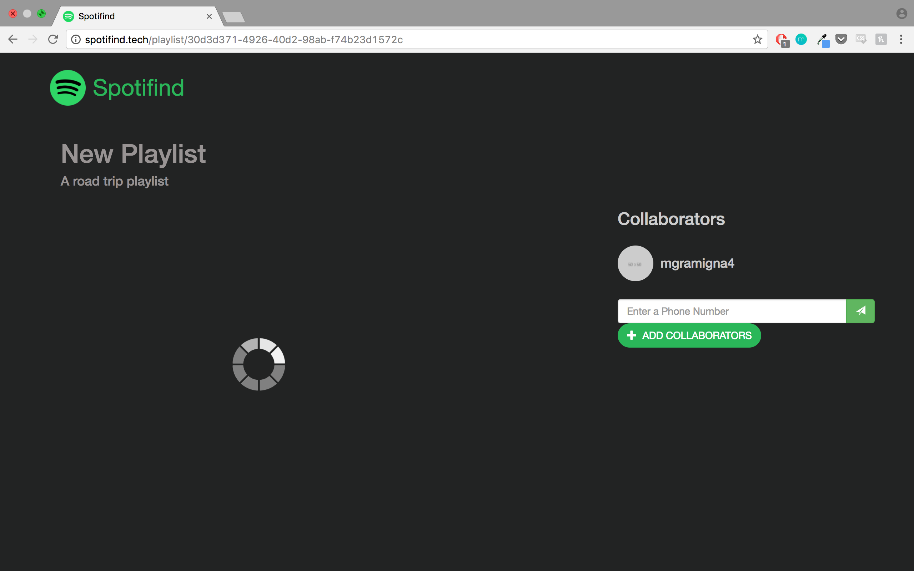
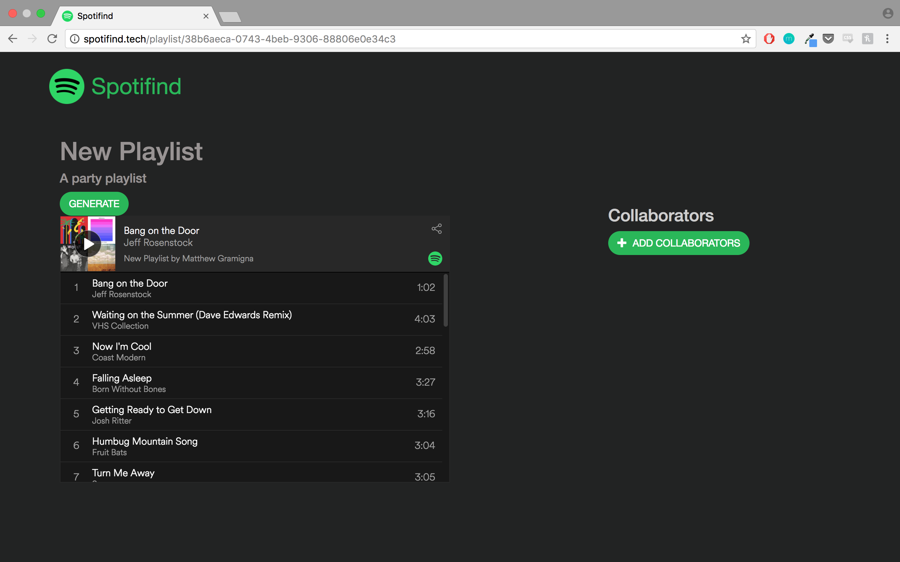

# Spotifind
Create playlists that combine all of your friends' music preferences! Spotifind allows you to connect your Spotify account, invite some friends, and auto-generate a playlist using an algorithm considering all of your music tastes and habit.

Developed at Hackumass V by Andrew Bass, Matthew Gramigna, and Justin Kennedy.

## Create a Playlist
You can specify a name, type, and size of your playlist. The available types are
* Party
* Road Trip
* Chill Hang
* Romantic
* Focus

## Invite Friends
Spotifind allows you to add collaborators to your playlist. You can input your friends' phone numbers and they will be sent an invite link. Once they accept your link, their Spotify data will also be used in the algorithm to create your new amazing playlist!

## Generate the Playlist

Once you (and your friends) have connected to the playlist, hit generate to run our algorithm to generate a stellar playlist.

Check your Spotify account. You can now see the playlist and do what you wish! The playlist will also appear in the homepage view.
